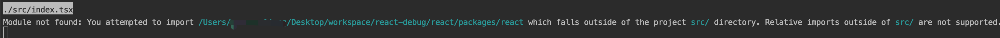
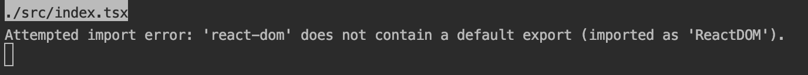
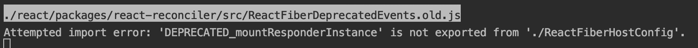
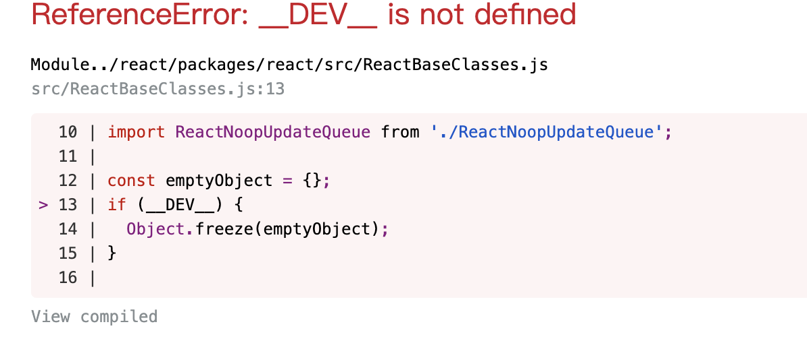
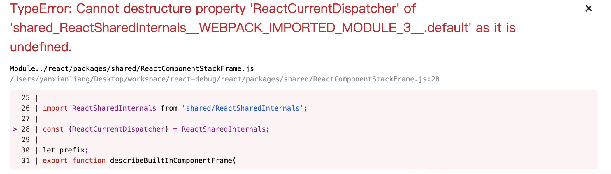
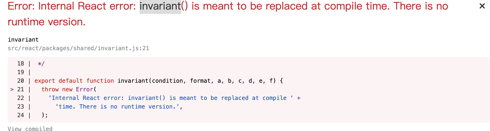
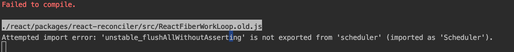
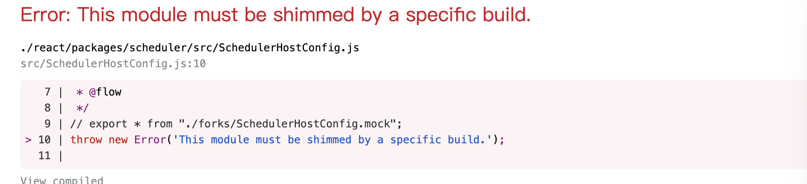

## 前言
React框架一直依赖都比较神秘，其原理大部分人都是通过博客进行了解，但是这种了解有局限性，博客中写的并不一定详细，稍微误差就容易造成理解歧义，而React源码的阅读相对来说比较困难，并不想vue源码一样直观，而我们想要详细了解一个框架源码就必须要对源码进行调试，通常项目中虽然也能调试，但是调试的都是node_modules下的react.development.js，比较难以阅读。本文主要介绍react真实源码的调试方式，通过这种调试我们可以更方便了解React每个package的作用。

## 步骤
1. 创建项目：使用create-react-app创建react demo项目
```shell
    npx create-react-app my-app --typescript
```
2. 弹出项目运行配置
```shell
    yarn eject
```
3. 拉取react源码
```shell
    git submodule add https://github.com/facebook/react.git react
```
拉取的源码会放在/react目录下
4. 修改webpack配置文件：`config/webpack.config.js`
```diff
alias: {
    // Support React Native Web
    // https://www.smashingmagazine.com/2016/08/a-glimpse-into-the-future-with-react-native-for-web/
    'react-native': 'react-native-web',
    // Allows for better profiling with ReactDevTools
    ...(isEnvProductionProfile && {
        'react-dom$': 'react-dom/profiling',
        'scheduler/tracing': 'scheduler/tracing-profiling',
    }),
    ...(modules.webpackAliases || {}),

+  'react': path.resolve(__dirname, '../react/packages/react'),
+  'react-dom': path.resolve(__dirname, '../react/packages/react-dom'),
+  'shared': path.resolve(__dirname, '../react/packages/shared'),
+  'react-reconciler': path.resolve(__dirname, '../react/packages/react-reconciler'),
+  'legacy-events':path.resolve(__dirname, '../react/packages/legacy-events'),
+  'scheduler':path.resolve(__dirname, '../react/packages/scheduler'),
},
```
5. 修改环境变量：`config/env.js`
```diff
const stringified = {
+   __DEV__: true,
+   SharedArrayBuffer: true,
+   spyOnDev: true,
+   spyOnDevAndProd: true,
+   spyOnProd: true,
+   __PROFILE__: true,
+   __UMD__: true,
+   __EXPERIMENTAL__: true,
+   __VARIANT__: true,
+   gate: true,
+   trustedTypes: true,

    'process.env': Object.keys(raw).reduce((env, key) => {
        env[key] = JSON.stringify(raw[key]);
        return env;
    }, {}),
};
```
6. 忽略React源码中flow类型：`/config/webpack.config.js`
```diff
 {
    test: /\.(js|mjs)$/,
    exclude: /@babel(?:\/|\\{1,2})runtime/,
    loader: require.resolve('babel-loader'),
    options: {
    babelrc: false,
    configFile: false,
    compact: false,
    presets: [
        [
            require.resolve('babel-preset-react-app/dependencies'),
            { helpers: true },
        ],
    ],
+   plugins: [
+       require.resolve('@babel/plugin-transform-flow-strip-types'),
+   ],
    cacheDirectory: true,
    // See #6846 for context on why cacheCompression is disabled
    cacheCompression: false,

    // Babel sourcemaps are needed for debugging into node_modules
    // code.  Without the options below, debuggers like VSCode
    // show incorrect code and set breakpoints on the wrong lines.
    sourceMaps: shouldUseSourceMap,
    inputSourceMap: shouldUseSourceMap,
    },
},
```
7. webstorm 中Javascript类型选择Flow，解决源码阅读时编辑器错误提示
8. 解决demo ts代码中`react`，`react-dom`类型提示错误
```shell
    rm -rf react/packages/react/src/__tests__
```
9. 错误提示
    - scope错误
    
    ```diff
    plugins: [
        // Adds support for installing with Plug'n'Play, leading to faster installs and adding
        // guards against forgotten dependencies and such.
        PnpWebpackPlugin,
        // Prevents users from importing files from outside of src/ (or node_modules/).
        // This often causes confusion because we only process files within src/ with babel.
        // To fix this, we prevent you from importing files out of src/ -- if you'd like to,
        // please link the files into your node_modules/ and let module-resolution kick in.
        // Make sure your source files are compiled, as they will not be processed in any way.
    -   new ModuleScopePlugin(paths.appSrc, [paths.appPackageJson]),
    +   new ModuleScopePlugin([paths.appSrc,path.resolve(__dirname,'../react')], [paths.appPackageJson]),
    ],
    ```
    - default 引用错误
    
    修改demo代码
    ```diff
    - import React from 'react';
    - import ReactDOM from 'react-dom';
    + import * as React from 'react';
    + import * as ReactDOM from 'react-dom';
    ```
    - 导出 HostConfig
    
    修改文件 `/react/packages/react-reconciler/src/ReactFiberHostConfig.js`
    ```diff
    -  import invariant from 'shared/invariant';

    // We expect that our Rollup, Jest, and Flow configurations
    // always shim this module with the corresponding host config
    // (either provided by a renderer, or a generic shim for npm).
    //
    // We should never resolve to this file, but it exists to make
    // sure that if we *do* accidentally break the configuration,
    // the failure isn't silent.

    -  invariant(false, 'This module must be shimmed by a specific renderer.');

    + export * from './forks/ReactFiberHostConfig.dom';
    ```
    - env错误
    
    参考上面env配置
    - import错误
    
    react 此时还未 `export`，因此需要直接从`ReactSharedInternals`取值，修改文件`/react/packages/shared/ReactSharedInternals.js`。
    ```diff
    + import ReactSharedInternals from '../react/src/ReactSharedInternals'

    - import * as React from 'react';

    - const ReactSharedInternals =
    -   React.__SECRET_INTERNALS_DO_NOT_USE_OR_YOU_WILL_BE_FIRED;

    export default ReactSharedInternals;
    ```
    - invariant错误
    
    修改`/react/packages/shared/invariant.js`
    ```diff
    export default function invariant(condition, format, a, b, c, d, e, f) {
    +   return;
        throw new Error(
            'Internal React error: invariant() is meant to be replaced at compile ' +
            'time. There is no runtime version.',
        );
    }
    ```
    - scheduler编译错误
    
    修改`/react/packages/scheduler/index.js`
    ```diff
        export * from './src/Scheduler';
    +   export * from "./src/forks/SchedulerHostConfig.mock";
    ```
    - SchedulerHostConfig报错
    
    修改`/react/packages/scheduler/src/SchedulerHostConfig.js`
    ```diff
    +   export * from "./forks/SchedulerHostConfig.mock";
    -   throw new Error('This module must be shimmed by a specific build.');
    ```

## 结尾
1. demo [git地址](https://github.com/yanxlg/react-debug.git)
2. 版本更新通过git submodule更新即可
3. 调试方式：网上资料较多，根据自己熟悉的编辑器查找调试方法，或者直接使用浏览器调试