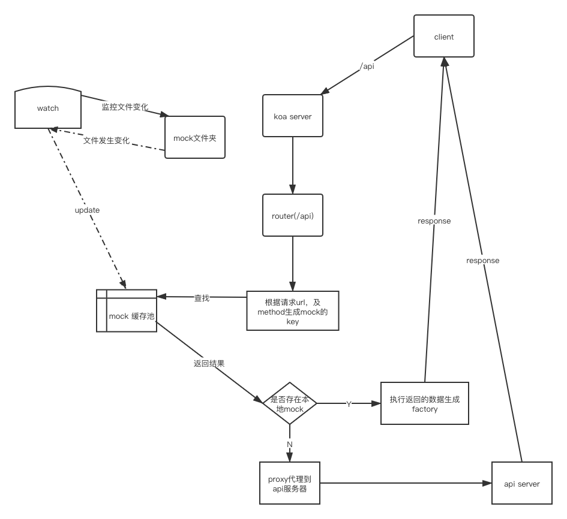

## 前言
在前端开发转型为前后端分离的今天，敏捷开发越来越重要，前后端分离中敏捷开发最重要的一环就是api mock，前端不需要等待服务端接口开发完成就可以进行业务开发和测试，甚至整个开发过程都可以不需要服务端来保证，只要严格按照定义的文档开发即可，这样大大提升了效率，较少了不同团队之间的沟通，开发过程实现解耦。要实现这样的开发模式，早期都是前端在项目中创建一个个json，用于封装请求库，根据配置去判断是读取本地json还是发送接口到服务端，后来随着mock的出现，该功能变得更加合理化。目前基本每个互联网公司都会自己部署一套内网的mock系统，例如`yAPi`，但是在线系统基本只能根据配置生成随机数据，而一些数据相关性很难实现，因此现在前端开发更流行的是本地mock server，例如`umi`和`vue`都有完善的本地mock server，只需要按照文档创建mock文件就会自动启动mock server，配合`proxy`可以将正常请求直接转发到mock server，相对于在线的mock系统，本地mock可以实现更加复杂严格的功能，例如数据相关性，数据计算等等。本文主要介绍本地mock server的搭建过程。

## 设计思路
具体的设计思路如下图：

由上图可以知道我们最终要的是实现mock缓存池，缓存池中存的是key-value健值对，键为`GET /api/xxx`或`POST /api/xx`的格式，由method+url组成，value支持`json`和`koa midway`。
- 缓存池实现：
    - 服务初次启动时，通过fs遍历mock文件夹下所有文件，使用require获取export的内容，将其处理后缓存在缓存变量中
    - 使用文件监听模块，例如`globbay`等，监听mock文件夹，当发生变化时通过require重新读取变化文件，并更新缓存变量

- mock数据生成：使用mockjs的node模块

## 遇到的问题
1. node中import和export报错：
    - 查询文档，设置node支持ES6模块
    - 使用babel-node或ts-node等第三方node启动服务
2. 文件更新后，require变化后的文件，发现内容没有变化：了解一下node的缓存就可以解决，清除node中对于该文件的缓存：
    ```typescript
        delete require.cache[require.resolve('./xx.js')];
    ```

