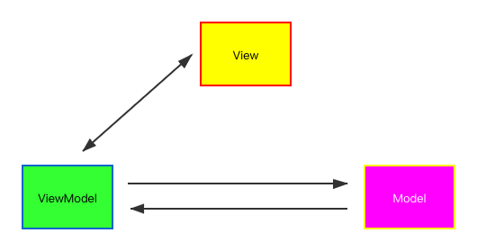

## 前言
Vue 作为近两年跟React几乎并驾齐驱的前端框架，其在前端开发中的地位是尤其重要，其轻量、易用、灵活、入门简单的特点收到很多前端开发者的推崇，本文主要揭秘Vue的架构、响应式原理、状态更新及vue@3重大更新。

## 架构
Vue是`MVVM`架构的最佳实践,是一个`JavaScript MVVM`库，是一套构建用户界面的渐进式框架。专注于 `MVVM` 中的 `ViewModel`，不仅做到了数据双向绑定，而且也是一款相对比较轻量级的JS 库。因此说到Vue架构不得不说`MVVM`。`MVVM`是目前前端主流架构之一，其从`MVC`演变而来，演变过程为`MVC->MVP->MVVM`。`MVVM`模式图如下：
